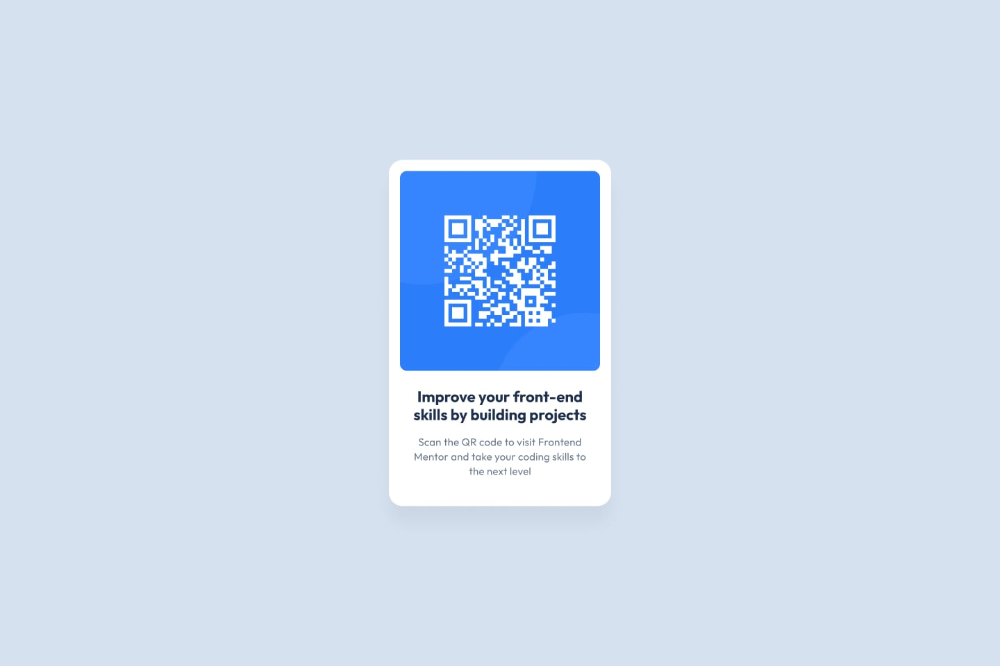

# Frontend Mentor - Componente de código QR


# Frontend Mentor - QR code component solution

Esta é uma solução para o desafio do componente de código QR no Frontend Mentor. Os desafios do Frontend Mentor ajudam a desenvolver habilidades práticas de front-end construindo projetos reais de design.

## Sumário

- [Visão geral](#visão-geral)
  - [O desafio](#o-desafio)
  - [Screenshot](#screenshot)
- [Meu processo](#meu-processo)
  - [Construído com](#construído-com)
  - [O que aprendi](#o-que-aprendi)
  - [Desenvolvimento contínuo](#desenvolvimento-contínuo)

## Visão geral

### O desafio

O objetivo deste desafio foi construir um componente de cartão com um QR Code integrado, garantindo que o layout ficasse o mais fiel possível aos designs estáticos fornecidos para dispositivos móveis (375px) e desktop (1440px).

### Screenshot



## Meu processo

### Construído com

- Marcação HTML5 semântica (`main`, `footer`)
- Propriedades personalizadas CSS (Variáveis para a paleta de cores)
- CSS Flexbox (Para centralização absoluta e alinhamento vertical dos elementos)
- Design responsivo baseado em largura fixa controlada com padding de segurança

### O que aprendi

Durante o desenvolvimento deste projeto, pratiquei conceitos fundamentais de estruturação e estilização:

1. **Uso de Variáveis CSS (`:root`):** Centralizar as cores do guia de estilo em variáveis facilitou a manutenção e organização do código.
2. **Centralização com Flexbox:** Utilizar `min-height: 100vh` combinado com `justify-content: center` e `align-items: center` no `body` provou ser a forma mais limpa de garantir que o componente fique perfeitamente centralizado em qualquer tamanho de ecrã.
3. **Importação de Fontes:** Configuração da fonte externa *Outfit* do Google Fonts aplicada globalmente usando herança.

Veja o trecho de CSS utilizado para alinhar perfeitamente o elemento no centro da página:

```css
body {
    background-color: var(--Slate300);
    display: flex;
    flex-direction: column;
    justify-content: center;
    align-items: center;
    min-height: 100vh;
    font-family: 'Outfit', sans-serif;
    padding: 20px;
}
